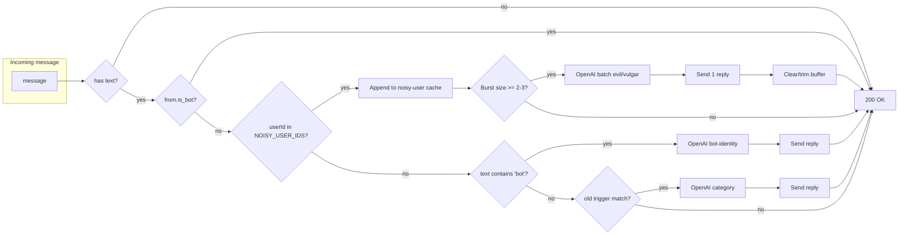

# Bot identity + Noisy users reply and cache

## Current behavior (to change)

- **Triggers**: Only when message matches one of the fixed phrases in `TRIGGER_BOT_POSITIVE`, `TRIGGER_BOT_NEGATIVE`, or `TRIGGER_VULGAR` in [api/webhook.js](api/webhook.js). There is no general "contains bot" handling for questions like "who are you", "what is this bot doing".
- **Cache**: In [lib/kv.js](lib/kv.js): (1) `appendChatHistory` / `getChatHistory` — last 5 messages per **chat** (any user), TTL 5 min; (2) `vulgar_count` per user + `isFrequentVulgar` (env `FREQUENT_VULGAR_USER_IDS` or count >= 3). Webhook uses chat history for OpenAI context and vulgar count for tone.
- **Flow**: Message → append chat history → if no trigger category, return; else get history → OpenAI → send reply (and incr vulgar count if vulgar).

## Target behavior

1. **Bot-identity queries**
  If the message **contains "bot"** (normalized), treat it as a bot-identity query: analyze with OpenAI and reply (who are you, what is this bot doing, how stressful, etc.). No need to match the current fixed lists for this path; a single "contains bot" check is enough to enter this branch.
2. **Noisy users (env)**
  - New env variable for Telegram user IDs (e.g. `NOISY_USER_IDS=7176721542,8435614998`).
  - **Reply to every message from these users** in the sense of “always consider them for a reply”, but **batch** their messages: they often send 3–5 messages in a short time (“message bomb”). Store only **noisy users’** messages in a dedicated cache; when there are enough recent messages from that user in that chat (e.g. 2–3 in the last 60 seconds), call OpenAI once on that batch and send **one** evil/vulgar reply to fight “channel breakers/eaters”.
3. **Remove existing caching**
  - Remove chat history for **all users** (`appendChatHistory` / `getChatHistory` usage and the per-chat key in KV).
  - Remove vulgar count and `isFrequentVulgar` / `FREQUENT_VULGAR_USER_IDS` logic.
4. **New cache: noisy users only**
  - One logical store: “recent messages from user X in chat Y” (e.g. key `noisy:${chatId}:${userId}`), list of `{ text, date }` or similar, TTL ~60–120 s, max size 5–10.
  - On message from noisy user: append to this buffer; if buffer has >= 2 (or 3) messages in the time window, call OpenAI with the **batch** (evil/vulgar system prompt), send one reply (e.g. reply_to the latest message_id), then clear or trim the buffer so we don’t reply again for the same burst.
5. **Tone**
  - For **noisy-user** replies: use **evil & vulgar** tone in the OpenAI system prompt (roast/mock channel breakers, aggressive, allowed to be harsh).
  - Bot-identity replies can stay informative/firm but not necessarily “evil”.

## Flow (high level)

- For **noisy users**: no “contains bot” or old trigger check; only the noisy-user cache + burst logic and one evil/vulgar reply per burst.
- For **others**: if text contains “bot”, run bot-identity OpenAI; else keep existing trigger categories (bot-positive, bot-negative, vulgar) but **without** chat history and without vulgar count (OpenAI gets only the current message, or a minimal context if you keep a tiny buffer for non-noisy later).

## Implementation outline

| Area                                 | Action                                                                                                                                                                                                                                                                                                                                                                                                                                                                                                                                                                                                                                                                                                                    |
| ------------------------------------ | ------------------------------------------------------------------------------------------------------------------------------------------------------------------------------------------------------------------------------------------------------------------------------------------------------------------------------------------------------------------------------------------------------------------------------------------------------------------------------------------------------------------------------------------------------------------------------------------------------------------------------------------------------------------------------------------------------------------------- |
| **Env**                              | Add `NOISY_USER_IDS` (comma-separated Telegram user IDs). Document in [.env.example](.env.example). Remove or repurpose `FREQUENT_VULGAR_USER_IDS` from docs.                                                                                                                                                                                                                                                                                                                                                                                                                                                                                                                                                             |
| **[lib/kv.js](lib/kv.js)**           | Remove `appendChatHistory`, `getChatHistory`, `getVulgarCount`, `incrVulgarCount`, `isFrequentVulgar`. Add: `appendNoisyUserMessage(chatId, userId, text, messageId)`, `getNoisyUserRecent(chatId, userId)`, and either `clearNoisyUserBuffer(chatId, userId)` or return-and-trim on read when building the batch. Key shape: `noisy:{chatId}:{userId}` → list of `{ text, messageId, ts }`, TTL 90–120 s, max length 5–10.                                                                                                                                                                                                                                                                                               |
| **[lib/openai.js](lib/openai.js)**   | Add `getReplyNoisyUser(recentMessages)` (or similar) with system prompt: evil & vulgar tone, roast channel breakers/eaters, one short reply. Optionally add `getReplyBotIdentity(currentMessage)` for “contains bot” queries. Keep `getReply(category, ...)` for non-noisy, but signature can drop `recentMessages` and `isFrequentVulgar` if we remove chat history and vulgar logic.                                                                                                                                                                                                                                                                                                                                    |
| **[api/webhook.js](api/webhook.js)** | (1) Parse `NOISY_USER_IDS` from env. (2) If `userId` in noisy list: append to noisy cache; if burst size >= threshold, get batch from cache, call `getReplyNoisyUser(batch)`, send one reply (reply_to latest message_id), clear buffer; return. (3) Else: if message text contains “bot” (normalized), call `getReplyBotIdentity(message.text)`, send reply; return. (4) Else: keep existing `getTriggerCategory` → `getReply(category, ...)` but call `getReply` with **no** chat history and no `isFrequentVulgar` (remove those args and any usage of `getChatHistory` / `isFrequentVulgar` / `incrVulgarCount`). (5) Remove all `appendChatHistory`, `getChatHistory`, `isFrequentVulgar`, `incrVulgarCount` usages. |

## Edge cases / decisions

- **Burst threshold**: 2 or 3 messages in the window (configurable constant).
- **Window**: 60–90 s TTL on the noisy buffer so we don’t reply to old messages.
- **Single message from noisy user**: no reply until a second (or third) message in the window; if they send only one and then stop, that one is not replied to (acceptable given “fight bombers” goal).
- **Bot-identity**: “contains bot” can overlap with current TRIGGER_BOT_* phrases; plan is to treat “contains bot” as a separate branch that always gets bot-identity OpenAI (so “good bot” could either go to bot-positive or bot-identity; decide once, e.g. bot-identity only if it doesn’t match bot-positive/bot-negative).

## Files to touch

- [.env.example](.env.example): add `NOISY_USER_IDS`, optional note removing `FREQUENT_VULGAR_USER_IDS`.
- [lib/kv.js](lib/kv.js): remove chat history + vulgar exports; add noisy-user-only cache APIs.
- [lib/openai.js](lib/openai.js): add evil/vulgar prompt for noisy batch; add bot-identity prompt; simplify `getReply` (no history, no isFrequentVulgar).
- [api/webhook.js](api/webhook.js): noisy-user branch first, then “contains bot” branch, then existing triggers without cache/vulgar; remove all old cache and vulgar usage.

