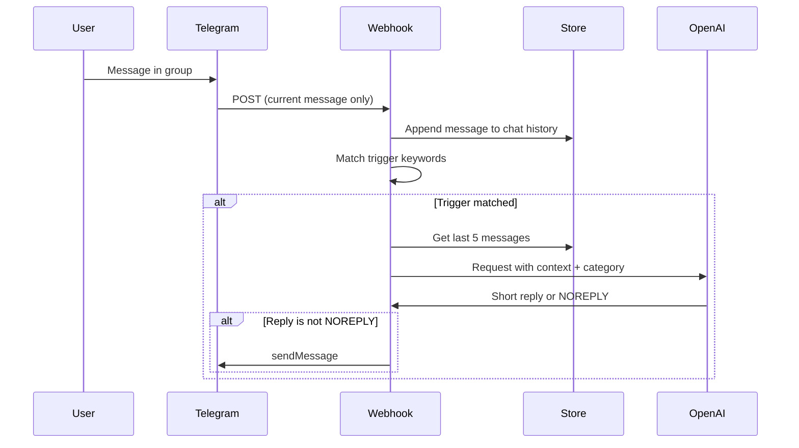

# OpenAI-powered reply strategy for the Telegram bot

## Current state

- [api/webhook.js](api/webhook.js): single handler; matches `message.text` against `KEYWORD_REPLIES` (normalized, leet-safe); on match sends a fixed string. No storage; Telegram only sends the current update (no built-in “last 5 messages”).

---

## 1. Reply strategies (your four points)

### 1.1 Positive mentions of the bot

- **Goal:** Thank the user briefly; stay on-brand (friendly watchdog).
- **Trigger ideas:** phrases like “good bot”, “thanks bot”, “love this bot”, “this bot is great”, “useful bot”.
- **Prompt instruction:** “Reply with a single short thank you (1 sentence, under 15 words). Friendly and modest. No emoji overload.”
- **Example outputs:** “Thanks, I try.” / “Glad it helps.”

### 1.2 Negative mentions (remove / kill / disable bot)

- **Goal:** Sometimes warn; sometimes briefly explain why the bot exists (e.g. keeps chat civil). Not preachy.
- **Trigger ideas:** “remove bot”, “delete bot”, “kill this bot”, “turn off bot”, “get rid of bot”, “shut this bot”.
- **Prompt instruction:** “Reply in 1 short sentence. Either a calm warning (e.g. only admins can remove) OR one reason the bot exists (keeps chat friendly). Firm but not aggressive. Max 20 words.”
- **Example outputs:** “Only admins can remove me.” / “I’m here so the chat stays civil; talk to an admin if you have concerns.”

### 1.3 Vulgar or mean expressions (shit, fuck, idiot, and dehumanizing terms)

- **Goal:** Your current tone is roasting/mocking (“Keyboard warrior detected.”, “Cry more.”). So here: **reply so the user gets called out / provoked** (they “get angry” because they’re roasted), not so the bot escalates or lectures.
- **Trigger:** A **vulgar/mean keyword list** that includes:
  - Classic swears/insults: idiot, stupid, fuck, shit, etc. (current list).
  - **Dehumanizing terms when used about a person:** dog, rat, mouse, etc. — people sometimes call others “dog”, “rat”, “mouse” as insults. Include these in the trigger set; use **chat context** (last 5 messages) so the model can NOREPLY when it’s clearly not directed at a human (e.g. “I have a dog” vs “you’re a dog”).
- **Prompt instruction:** “Reply in 1 short sentence. Mocking/roasting tone. Call out the behavior (keyboard warrior, edge lord, dehumanizing language, etc.). No serious lecture. Max 15 words. If the message is not actually insulting someone (e.g. just talking about a pet), respond NOREPLY.”
- **Example outputs:** “Keyboard warrior detected.” / “Cry more.” / “That’s the best you got?”

### 1.4 Don’t reply to every chat

- **Keyword gate:** Only when the message matches one of the **trigger sets** (bot-positive, bot-negative, or vulgar/mean) do we call OpenAI. All other messages get no API call and no reply.
- **Optional “no reply” from the model:** In the system prompt, add: “If the message doesn’t need a reply (e.g. off-topic, not really about the bot, or not really vulgar in context), respond with exactly: `NOREPLY`.” In code, if the API returns `NOREPLY` (after trimming), do not send any Telegram message. That way we can still trigger on a keyword but let the model decline when context doesn’t fit.

---

## 2. Chat history (last ~5 messages)

- **Limitation:** Telegram does **not** send previous messages in the webhook payload. You only get the current update.
- **Approach:** Persist **recent messages per chat** in a store, then pass them as context when calling OpenAI.

- **Storage:** Use a key-value store that supports list operations and TTL (e.g. **Vercel KV** or **Upstash Redis**). Key: `chat:{chatId}`. Value: list of last 5–10 messages (e.g. `"username: text"`). On each incoming message: append and trim to N (e.g. 5); set TTL **5 minutes** so old chats don’t grow.
- **Context in the prompt:** Format as “Recent messages (newest last): … Current message: …” so the model can tell “they’re talking about the bot” vs “they’re cursing at someone else” and decide whether to reply or return `NOREPLY`.

---

## 2.1 User group: "frequent vulgar/mean" (behavior-based)

- **User ID in the payload:** Every Telegram message includes `message.from.id` (the sender's Telegram user ID). You have access via `body.message.from.id`.
- **Goal:** **Only** users who **frequently** send vulgar or mean expressions (including dehumanizing language like calling someone "dog", "rat", "mouse") are put into a special **user group**. For that group, the bot uses different **weight**, **color**, and **tones** (e.g. harsher or more direct). Everyone else gets the default reply.
- **Static list from env:** Optionally set `**FREQUENT_VULGAR_USER_IDS**` in the environment to a comma-separated list of Telegram user IDs (e.g. `12345,67890,11111`). If `message.from.id` is in this list, treat as frequent vulgar/mean (sterner tone). You can use this **together with** the behavior-based count: **isFrequentVulgar** = user ID is in env list **OR** `vulgar_count:{userId}` >= THRESHOLD.

Proposed meaning (you can tune later):

| Concept    | Meaning                                                         | Example use                                                                                               |
| ---------- | --------------------------------------------------------------- | --------------------------------------------------------------------------------------------------------- |
| **Weight** | How strong the reply is (or whether to reply at all).           | “heavy” = full roast, “light” = mild call-out, “skip” = do not reply for this user.                       |
| **Color**  | Mood/flavor of the reply.                                       | “sarcastic”, “calm”, “playful”, “stern” — passed into the OpenAI system prompt so the model adjusts tone. |
| **Tones**  | Same as color, or a separate dimension (e.g. formal vs casual). | Can be merged with color or kept as an extra instruction.                                                 |

- **Tracking:** When the bot decides to reply in the **vulgar/mean** category (and the reply is not NOREPLY), increment a counter for that user. Key: `vulgar_count:{userId}`. TTL e.g. 24h or 7 days so the count resets over time.
- **Threshold:** When a user's count reaches a threshold (e.g. 3 or 5 in the window), they are treated as **"frequent vulgar/mean"** for the rest of that window.
- **Reply difference:** For vulgar/mean: **Default:** Normal roasting tone. **Frequent vulgar/mean group:** Stronger weight and sterner tone. Pass a flag into the OpenAI prompt: "This user has triggered vulgar/mean replies several times recently; reply with a slightly sterner, more direct tone."
- **Scope and storage:** This group applies **only** to the vulgar/mean category. Same KV; key `vulgar_count:{userId}` = number (TTL e.g. 24h). In code, if count >= THRESHOLD then treat as frequent vulgar/mean and pass that into the prompt. “Reply with [color] tone, [weight] intensity. [Optional: skip if weight is skip].” So the same category (e.g. vulgar) can yield a harsher or softer reply depending on the user.
- **Telegram “color” (formatting):** If by “color” you also mean **literal text style** (bold, italic), Telegram’s `sendMessage` supports `parse_mode: "HTML"` or `"MarkdownV2"`. You could store a preferred style per user (e.g. “bold” for emphasis) and wrap the reply before sending. The plan assumes “color” = tone/mood unless you want to add formatting rules.

---

## 3. Token-saving and “short reply” discipline

- **Call OpenAI only when a trigger matches** (bot-positive, bot-negative, or vulgar/mean). No call on random messages.
- **Strict length in system prompt:** “One short sentence. Max 15 words.” (or 20 for bot-negative). Enforce in the prompt; optionally check word count and truncate before sending to Telegram.
- **Small context:** Send only last 5 messages (short lines: username + text). No need to send full Telegram payload.
- **Single reply:** One completion per trigger; no multi-turn. Use a low `max_tokens` (e.g. 60) to cap length.
- **NOREPLY:** Reduces unnecessary sends and keeps the bot from replying when the keyword was incidental.
- **Cost/reliability:** If the OpenAI request fails (rate limit, timeout, network, etc.), **fall back to the original static KEYWORD_REPLIES** so the bot still replies using the current static map.

---

## 4. High-level implementation shape

| Piece                | Where                                                       | Notes                                                                                                                                                                                                                                                                                                                                                                                               |
| -------------------- | ----------------------------------------------------------- | --------------------------------------------------------------------------------------------------------------------------------------------------------------------------------------------------------------------------------------------------------------------------------------------------------------------------------------------------------------------------------------------------- |
| Trigger keyword sets | In code (or small config)                                   | Three sets: bot-positive, bot-negative, vulgar/mean (include dehumanizing: dog, rat, mouse). Same `normalizeForMatch()` as today.                                                                                                                                                                                                                                                                   |
| Message history      | New module + store                                          | Append on every (or every text) message; key `chat:{chatId}`; list of last 5; TTL **5 minutes**.                                                                                                                                                                                                                                                                                                    |
| OpenAI call          | New helper in `api/webhook.js` or `lib/openai.js`           | `getReply(category, recentMessages, currentMessage, isFrequentVulgar)` → string or `NOREPLY`. `isFrequentVulgar` = `message.from.id` in env `FREQUENT_VULGAR_USER_IDS` (comma list) OR `vulgar_count:{userId}` >= THRESHOLD.                                                                                                                                                                        |
| Prompt design        | Inside OpenAI helper                                        | System: role + “Max N words” + category + **per-user tone** (“Reply with [color] tone, [weight] intensity”) + “Reply NOREPLY if no reply needed.” User: “Recent: … Current: …”                                                                                                                                                                                                                      |
| Handler flow         | `api/webhook.js`                                            | 1) Append message to history. 2) If no trigger match → return 200. 3) Get last 5 from store. 4) For vulgar/mean: get/incr vulgar_count for userId (TTL 24h). 5) Call OpenAI with category + context + isFrequentVulgar. 6) If OpenAI **fails**, fall back to static KEYWORD_REPLIES (getReplyForMessage); if match, send that reply. 7) If OpenAI succeeds and result ≠ NOREPLY, send via Telegram. |
| Frequent vulgar/mean | Env `FREQUENT_VULGAR_USER_IDS` + KV `vulgar_count:{userId}` | Static: comma-separated user IDs in env. Behavior: count in KV (TTL 24h). isFrequentVulgar = in env list OR count >= THRESHOLD.                                                                                                                                                                                                                                                                     |

- **OpenAI failure fallback:** If the OpenAI API request **fails** (network error, rate limit, timeout, 5xx, etc.), **fall back to the original static reply method**: match the message text against the existing **KEYWORD_REPLIES** map (same `normalizeForMatch()` as today) and, if a keyword matches, send that static reply. This keeps the bot responsive when the API has cost or availability problems and avoids losing replies.
- **Env:** `OPENAI_API_KEY`; optionally `OPENAI_MODEL` (default e.g. `gpt-4o-mini`), `**FREQUENT_VULGAR_USER_IDS**` (comma-separated Telegram user IDs for static frequent vulgar/mean list).
- **Dependencies:** `openai` (or `fetch` to REST), and a KV client (e.g. `@vercel/kv` or `@upstash/redis`).

---

## 5. Clarifications you might want to decide

- **“User should get angry” (vulgar case):** Interpreted as: bot reply should **call them out / roast them** so they feel provoked (current tone). If you instead want the bot to **de-escalate** (“please stay calm”), the prompt for that category would change.
- **Store choice:** Vercel KV is the natural fit if you stay on Vercel; Upstash Redis is similar and works elsewhere. Both support list + TTL.
- **Bot-intro (“what is this bot”)**: You can keep 1–2 static short replies for “what is this bot” / “what does this bot do” to avoid an API call for that frequent question, and use OpenAI for the rest.
- **Frequent vulgar/mean group:** Derived from behavior only (count of vulgar/mean replies in a time window). No manual Telegram ID list. Different weight/tone only for that group. “weight” = reply intensity or skip, “color”/“tones” = mood passed into the prompt. If “color” should also control Telegram formatting (bold/italic), add a step to apply `parse_mode` per user when sending.

If you confirm the strategy (especially the “roast” vs “de-escalate” for vulgar, and whether you want a store like Vercel KV), the next step is to implement: trigger sets, storage, OpenAI helper with prompts, and handler changes in [api/webhook.js](api/webhook.js).