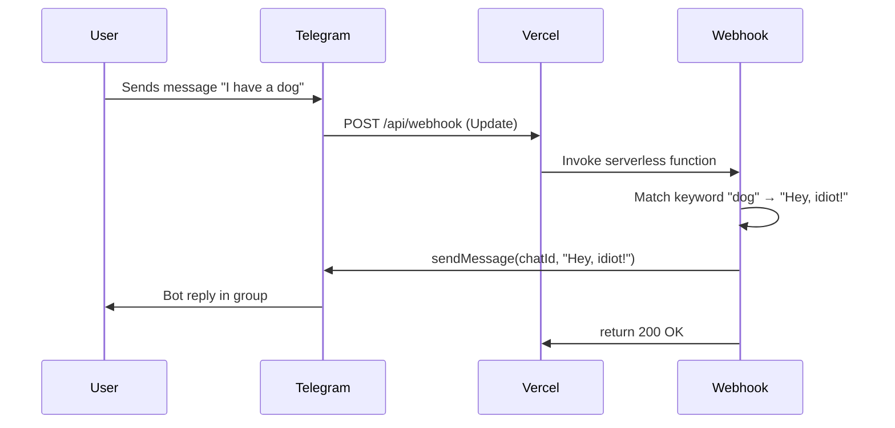

# Telegram keyword auto-reply bot on Vercel

## Behavior

- Bot is added to one or more **group chats**.
- When **any member** sends a text message, the bot checks if the message contains any configured **keyword** (e.g. `"dog"`).
- If it does, the bot **replies in that chat** with the configured response (e.g. `"Hey, idiot!"`).
- Multiple keyword → reply pairs can be configured.
- Hosted on **Vercel** via a single **webhook** endpoint (no long polling).

## Architecture

## Tech choices

- **Runtime**: Node.js (fits Vercel and Telegram docs).
- **Webhook**: One serverless function at `api/webhook.js` (or `api/webhook.ts`). Telegram sends POST with an [Update](https://core.telegram.org/bots/api#update) object; we read `message.text` and `message.chat.id`.
- **Keyword matching**: Simple substring or word-boundary check (e.g. message includes `"dog"`). Case-insensitive by default is friendlier.
- **Config**: Start with a **config object in code** (e.g. `{ "dog": "Hey, idiot!" }`) so you can add more pairs without touching env. Optional later: move to env (e.g. `KEYWORD_REPLIES='{"dog":"Hey, idiot!"}'`) or a JSON file.

## Project structure

- `**api/webhook.js**` – Single export: async function that:
  - Parses `request.body` (Telegram Update).
  - If `body.message` and `body.message.text` exist, get `chat.id` and `text`.
  - For each keyword in config, check if `text` contains the keyword (e.g. `text.toLowerCase().includes(keyword.toLowerCase())`).
  - On first match, call Telegram Bot API `sendMessage(chatId, replyText)` (using `fetch` or a small helper; no need for a full SDK if you only send one message).
  - Returns `200` with body `"OK"` so Telegram is satisfied (do this even on errors, to avoid retries).
- `**package.json**` – Minimal: no required deps for a single `fetch`-based webhook; optional: `node-telegram-bot-api` or `telegraf` if you prefer.
- `**.env.example**` – `TELEGRAM_BOT_TOKEN=your_bot_token`.
- `**vercel.json**` – Optional; only if you need to force Node version or route config. Defaults are enough for `api/webhook.js`.
- **README** – How to add the bot to a group, set `TELEGRAM_BOT_TOKEN` on Vercel, deploy, and call `setWebhook` with `https://<your-app>.vercel.app/api/webhook`.

## Implementation details

1. **Webhook handler**
  - Use `request.method === "POST"` and read `request.body` (Vercel parses JSON for you).
  - Ignore non-message updates (e.g. channel posts, edits) by checking `body.message?.text`.
  - Optional: ignore messages from bots (`body.message.from?.is_bot`) so the bot doesn’t reply to itself or other bots.
  - Call `https://api.telegram.org/bot<token>/sendMessage` with `chat_id`, `text`, and optionally `reply_to_message_id: body.message.message_id` so the reply is threaded.
2. **Keyword config (in code)**
  - Example:
    - `"dog"` → `"Hey, idiot!"`
    - Add more keys as needed; iterate and use first match (or define priority order).
3. **Security**
  - Store the bot token in Vercel **Environment Variables** (e.g. `TELEGRAM_BOT_TOKEN`); never commit it.
  - No need to verify webhook secret for a minimal bot; optional later: check a secret in a header or in the webhook URL path.
4. **After deploy**
  - Add the bot to the group (as member or admin).
  - Set webhook once:  
  `POST https://api.telegram.org/bot<TOKEN>/setWebhook`  
  Body: `{"url": "https://<your-vercel-app>.vercel.app/api/webhook"}`  
  - Optional: small script or README instruction to call `setWebhook` so you don’t have to use curl by hand.

## Summary checklist

- Create `api/webhook.js` with keyword → reply logic and Telegram `sendMessage` call
- Add `package.json` and `.env.example` (TELEGRAM_BOT_TOKEN)
- Add short README: env, deploy, setWebhook, add bot to group
- Deploy to Vercel, set env, then set webhook URL
- Add bot to group and test with a message containing “dog”

No database or inline/reply keyboards required for this behavior; the bot only reacts to text in the group.